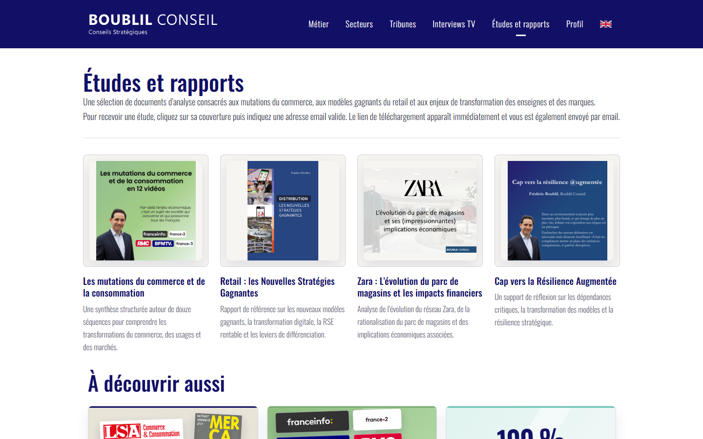
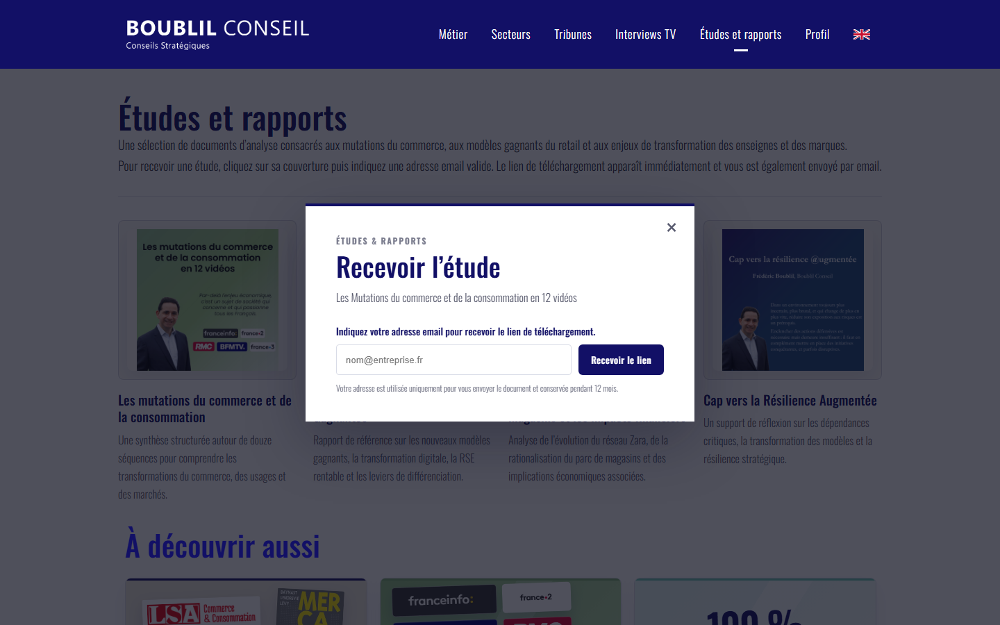
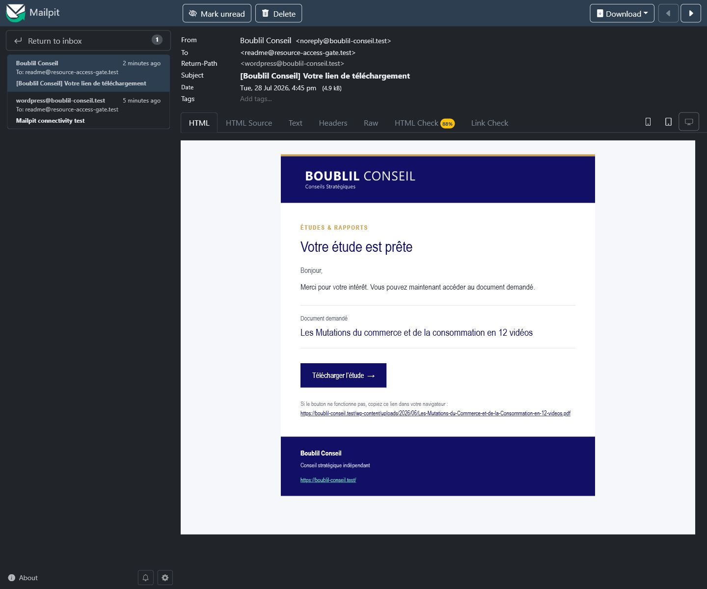

<!--
Copyright (C) 2026 Eli Gold

This documentation is part of Resource Access Gate and is distributed under
the GNU General Public License, version 3 or (at your option) any later version.
See LICENSE for the complete license terms.

SPDX-License-Identifier: GPL-3.0-or-later
-->

<div align="center">

# Resource Access Gate

**Unlimited email-gated resource downloads for WordPress — free forever and free software.**

[](https://github.com/elig-45/resource-access-gate/releases/latest)
[](#requirements)
[](#requirements)
[](LICENSE)
[](https://github.com/elig-45/resource-access-gate/releases)

<a href="https://u.fsf.org/16e"></a>

[Features](#why-use-it) · [Quick start](#quick-start) · [Screenshots](#screenshots) · [Download](https://github.com/elig-45/resource-access-gate/releases/latest)

</div>

Resource Access Gate is a lightweight plugin for publishers, consultants, agencies, creators, and teams who want to share PDFs, reports, templates, white papers, decks, or private files without adding a heavy marketing platform.

Visitors enter a valid email address, the download link appears instantly, and the same link is sent in a branded, responsive HTML email with a plain-text fallback. Requests are stored in WordPress and can be reviewed or exported from the admin area.

## Free Means Free

This is not a freemium plugin.

- No premium tier
- No paid unlocks
- No artificial resource limits
- No submission caps
- No vendor account required
- No bundled tracking or front-end branding links
- Free software under GPL-3.0-or-later

The only practical limits are your WordPress hosting, database, and email delivery setup.

## Why Use It

- No third-party service required
- Works with a simple shortcode
- Keeps resource URLs out of the initial page HTML
- Sends download links with WordPress mail
- Supports localized French and English front-end messages and emails
- Stores contacts and requests in dedicated database tables
- Displays a configurable privacy notice and automatically purges expired data
- Limits repeated requests and rejects honeypot submissions
- Provides CSV export for follow-up workflows
- Ships as a small, understandable WordPress plugin

## Quick Start

1. Copy `resource-access-gate` into `wp-content/plugins/`.
2. Activate **Resource Access Gate** in WordPress.
3. Open **Resources** in the admin menu.
4. Add a resource ID, title, and file URL.
5. Place the shortcode where the form should appear:

```text
[resource_access_gate id="resource-id"]
```

To render the form in an accessible modal opened by another element, give that
element a `data-rag-open` attribute matching the modal ID:

```html
<button type="button" data-rag-open="report-modal">Open the report form</button>
[resource_access_gate id="resource-id" mode="modal" modal_id="report-modal"]
```

## Screenshots

<table>
  <tr>
    <td width="50%">
      
    </td>
    <td width="50%">
      
    </td>
  </tr>
  <tr>
    <td align="center"><strong>Studies and reports grid</strong></td>
    <td align="center"><strong>Accessible request modal</strong></td>
  </tr>
  <tr>
    <td colspan="2">
      
    </td>
  </tr>
  <tr>
    <td colspan="2" align="center"><strong>Branded HTML email received in Mailpit</strong></td>
  </tr>
</table>

> **Screenshot notice:** all examples visible in these screenshots—including
> names, logos, trademarks, publication covers, report content, and site
> content—remain **all rights reserved** by their respective rights holders.
> They are shown solely for documentation and illustrative purposes. The
> GPL-3.0-or-later license for Resource Access Gate does not grant any rights
> to this underlying example content.

## How It Works

The public page only receives the resource ID. After a valid email is submitted, WordPress validates the request, logs the contact and request, sends the email, and returns the download URL to the browser.

This keeps the visitor flow simple while avoiding resource links being exposed in the initial HTML.

## Admin Features

- Configure sender name and sender email
- Customize email subject and front-end messages
- Configure the privacy notice and retention duration
- Add, edit, enable, and disable resources
- View recent download requests
- Track whether the email was sent successfully
- Export all requests as CSV

## Privacy

Resource Access Gate stores submitted email addresses, requested resource IDs, timestamps, email-send status, and hashed request metadata such as IP address and user agent. It does not send this data to an external service.

Sites using this plugin should mention the collection of email addresses in their own privacy policy.

## Mail Delivery

The plugin uses `wp_mail()` and sends a responsive HTML template with a plain-text alternative. The template automatically reuses the active Bridge logo when available and follows the Boublil Conseil color palette. For reliable delivery in production, configure WordPress with a proper SMTP or transactional email setup.

## WordPress.org

The repository includes a `readme.txt` formatted for the WordPress.org Plugin Directory.

For WordPress.org submissions, the `Contributors` field uses the WordPress.org username. GitHub links use the GitHub username.

## Requirements

- WordPress 5.8 or later
- PHP 7.4 or later

Tested locally up to WordPress 7.0.

## License

Copyright (C) 2026 Eli Gold.

Resource Access Gate source code and original documentation are free software
distributed under the **GNU General Public License, version 3 or (at your
option) any later version** (`GPL-3.0-or-later`). You may use, study, modify,
and redistribute them under the terms in [LICENSE](LICENSE).

Third-party examples visible in screenshots are excluded from this license, as
described in [the screenshot notice](assets/screenshots/README.md).

## Author

Eli Gold  
GitHub: https://github.com/elig-45
